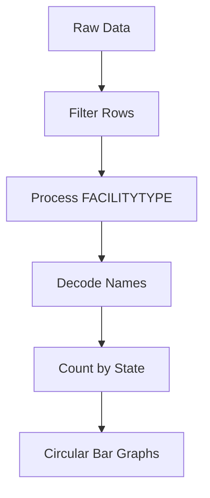
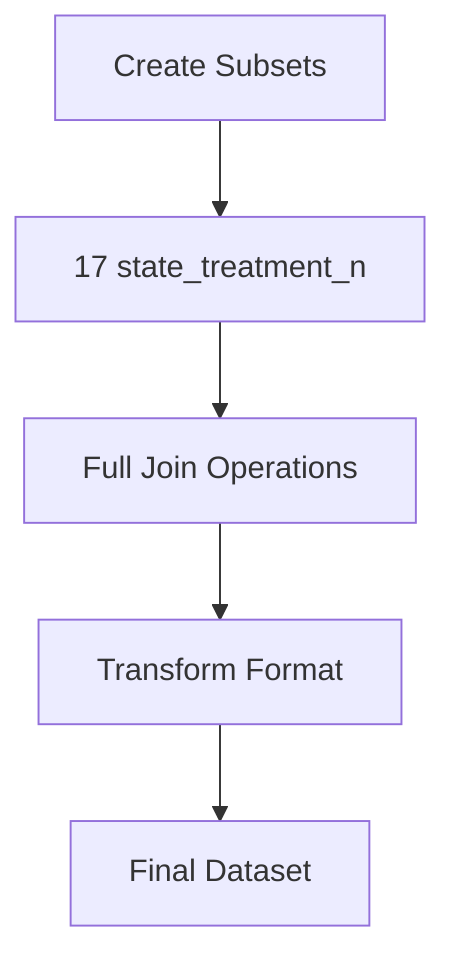

# US Nation-wide Mental Health Facilities 🏥

[](https://shiny.rstudio.com/)
[](https://www.samhsa.gov/)
[](https://www.samhsa.gov/)

## 👥 Authors
<table>
  <tr>
    <td align="center">
      <div>
        <b>Abby Wang</b>
        <br>
        Data Analysis & Visualization
      </div>
    </td>
</table>

## 📊 Project Overview

An interactive dashboard analyzing mental health facilities across the United States, providing insights into:
- 🏗️ Facility type distribution
- 💊 Treatment availability
- 🩺 Mental health diagnosis patterns

<details>
<summary><h2>🔍 Methodology</h2></summary>

### 1️⃣ Data Preprocessing

<details>
<summary><b>Facility Type Analysis</b></summary>



- Processed 'FACILITYTYPE' variable (1-13 encoding)
- Decoded facility names
- Created state-wise facility counts
- Generated top 10 facility visualizations
</details>

<details>
<summary><b>Treatment Analysis</b></summary>



- Created 17 treatment subsets
- Merged using full-join operations
- Transformed into long format
- Columns: LST, treatments, counts
</details>

<details>
<summary><b>Mental Health Disease Analysis</b></summary>

- Analyzed MH1, MH2, MH3 variables
- Captured comorbidities
- Joined by LST and illness_type
- Aggregated disease distribution
</details>

### 2️⃣ Geographic Mapping

<table>
  <tr>
    <th>Component</th>
    <th>Description</th>
  </tr>
  <tr>
    <td><b>State Code Mapping</b></td>
    <td>Created mapping system between codes and abbreviations</td>
  </tr>
  <tr>
    <td><b>Diagnosis Coding</b></td>
    <td>Categorized using NUMMHS variable (0-3 range)</td>
  </tr>
  <tr>
    <td><b>Data Integration</b></td>
    <td>Merged facility and diagnosis data using STATE key</td>
  </tr>
</table>

### 3️⃣ Visualization Implementation

<div align="center">

| Type | Description | Tool Used |
|:---:|:---|:---:|
| 🗺️ Choropleth | Distribution map | Leaflet |
| 📊 Dashboard | Circular bar charts | ggplot2 |
| 📈 Distribution | Diagnosis patterns | Plotly |

</div>
</details>

## 🛠️ Tech Stack

<div align="center">

| Technology | Purpose |
|:---:|:---|
| R Shiny | Interactive dashboard framework |
| ggplot2 | Data visualization |
| tidyverse | Data manipulation |
| leaflet | Geographic visualization |
| plotly | Interactive charts |

</div>

## 📊 Interactive Visualizations

### 1. National Distribution Map 🗺️

<div align="center">
< img src="images/choropleth_map.png" alt="Mental Health Facilities Map">
<br>
<b>US Mental Health Facilities Distribution</b>
<br>
<em>Interactive choropleth map showing the distribution of mental health facilities across the United States</em>
</div>

#### Map Features
- 🔍 **Interactive Hovering**: View detailed statistics for each state
- 🎨 **Color Gradient**: Darker shades indicate higher concentration of facilities
- 📊 **Facility Counts**: Shows the number of mental health facilities per state
- 🔄 **Dynamic Legend**: Clear visualization of data ranges

### 2. State-Level Analysis Dashboard

<div align="center">
< img src="images/dashboard_preview.png" alt="Dashboard Preview">
</div>

### 3. Detailed State Visualizations

<table>
<tr>
<td width="33%" align="center">
< img src="images/facilities_chart.png" alt="Facilities Chart">
<br>
<b>Facilities Distribution</b>
<br>
<em>Circular bar chart showing top 10 facility types</em>
</td>
<td width="33%" align="center">
< img src="images/treatments_chart.png" alt="Treatments Chart">
<br>
<b>Treatment Analysis</b>
<br>
<em>Popular treatments in selected state</em>
</td>
<td width="33%" align="center">
< img src="images/diagnosis_chart.png" alt="Diagnosis Chart">
<br>
<b>Diagnosis Patterns</b>
<br>
<em>Mental health diagnosis distribution</em>
</td>
</tr>
</table>

## 🚀 Run the Dashboard Locally

```R
# Install required packages
install.packages(c(
    "shiny",
    "ggplot2",
    "usmap",
    "readr",
    "tidyverse",
    "feb2",
    "dplyr",
    "sf",
    "leaflet"
))

# Clone this repository
# git clone [your-repository-url]

# Run the Shiny app
shiny::runApp()
```

## 🎯 Dashboard Features

### Interactive Elements
- 🌎 **National Map**: Explore facility distribution across the US
- 📊 **State Selection**: Drop-down menu for detailed state analysis
- 📈 **Dynamic Charts**: Auto-updating visualizations
- 🔄 **Multiple Views**: Toggle between different metrics

### Data Insights
- 🏥 **Facility Types**: Distribution of mental health facilities
- 💊 **Treatment Availability**: Treatment options by state
- 🩺 **Diagnosis Patterns**: Mental health diagnosis distribution
- 📊 **State Analysis**: Detailed state-level statistics


---
<div align="center">
  <i>This project analyzes mental health facility data from the National Mental Health Services Survey (N-MHSS) and Mental Health Client-Level Data (MH-CLD) 2020.</i>
</div>
